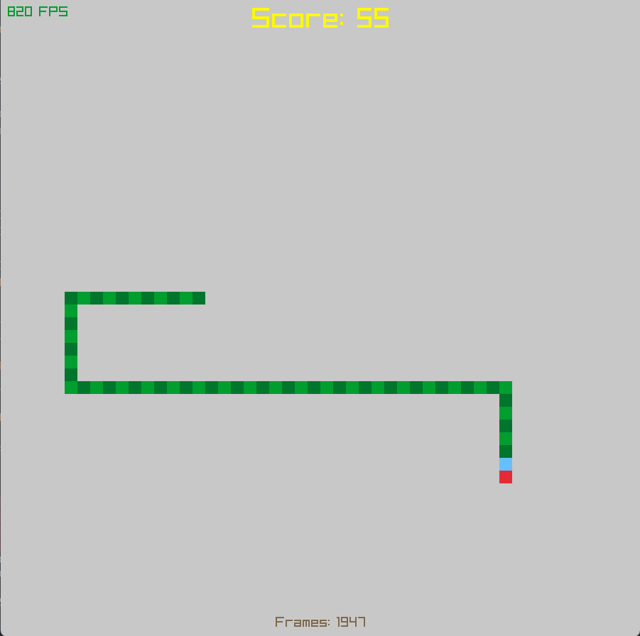

# Rust-Snake
A Rust implementation of snake using Raylib. Has a few algorithms to play snake. 
 

## A*
First there's A*, which is probably the most used pathfinding algorithm. I used it here quite simply to find the shortest path to the food without hitting my own tail. 
If there is no direct path, the snake will move in a random direction with a free space or the direction with the most space (whichever you choose).

[Geeks for Geeks](https://www.geeksforgeeks.org/a-search-algorithm/)
[Sebastian Lague](https://www.youtube.com/watch?v=-L-WgKMFuhE&ab_channel=SebastianLague)

## Hamiltonian cycles
These are quite complicated but in short, it's a path that goes over every cell once and ends where it started. I was going to do a very complicated implementation, but I couldn't figure out how to make it work so I made a very simple one that also creates one such path.

[Geeks for Geeks Hamiltonian cycle](https://www.geeksforgeeks.org/hamiltonian-cycle-backtracking-6/) 
[Tutorialspoint Hamiltonian cycle](https://www.tutorialspoint.com/Hamiltonian-Cycle) 
[John Flux](https://johnflux.com/2015/05/02/nokia-6110-part-3-algorithms/) 
[Gamedev Stack Exchange](https://gamedev.stackexchange.com/questions/133460/how-to-find-a-safe-path-for-an-ai-snake)
[Chuyangliu](https://github.com/chuyangliu/snake/blob/master/snake/solver/hamilton.py)
[Other algorithms](https://github.com/gsurma/slitherin) 
[Non-trivial Hamiltonian path](https://www.youtube.com/watch?v=u4PDNUO78rA&ab_channel=YulianYarema)
[Minimum spanning tree](https://www.geeksforgeeks.org/properties-of-minimum-spanning-tree-mst/)
